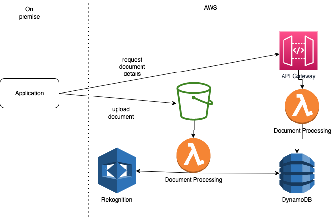
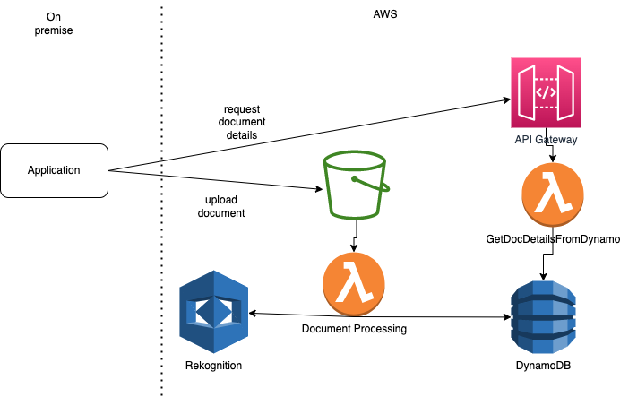

# aws-sam-dms
[Intelligent Document Processing (IDP)](https://aws.amazon.com/machine-learning/ml-use-cases/document-processing/) to build a Document Management System on AWS Serverless, deployed using AWS SAM

This project contains source code and supporting files for a serverless application that you can deploy with the SAM CLI. The application is a starting point to build a serverless document management system (DMS). It allows you to upload files to Amazon S3, which then invokes a Lambda that does various analysis of the document, and stores the results of the analysis on Amazon DynamoDB. You can then query the results via an API exposed using Amazon API Gateway.

The analysis can include:
- doing facial analysis on pictures using Amazon Rekognition
- extracting text using Amazon Textract
- and much more

The idea is that you have an existing application where your users need to upload documents, e.g. ID or proof of residence documents. Its in-efficient and expensive to store and manage these documents locally in your application file system or relational database, and requires manual effort to verify their authenticity. Using this sample DMS application on AWS, you can store these documents safely and cheaply in AWS, and automate the verification and extraction of data.

#Architecture

# How to build and deploy
- Install [AWS CLI](https://docs.aws.amazon.com/cli/latest/userguide/install-cliv2.html), and [configure it](https://docs.aws.amazon.com/cli/latest/userguide/cli-configure-quickstart.html#cli-configure-quickstart-config) for the region you going to use. If you later change the region, then ideally change the default region in the AWS CLI config, or alternatively you will need to append `--region af-south-1` all commands below, if you want to use the Africa Cape Town region, for example.
- Install [AWS SAM CLI](https://docs.aws.amazon.com/serverless-application-model/latest/developerguide/serverless-sam-cli-install.html)
- Update the S3 bucket name in `template.yaml` by updating the `BucketName` variable to something of your choice. Amazon S3 supports global buckets, which means that each bucket name must be unique across all AWS accounts in all the AWS Regions.
- Run `sam build`
- Run `sam deploy --guided` the first time, which will guide to choose a stack name, region, etc. These options will be saved, so in subsequent runs after making changes, you only need to run `sam build && sam deploy`

# How to run and interact with the DMS

When uploading the document to S3, you can specifiy some metadata, which allows to link to to an ID in your application. E.g. you can use the AWS CLI to upload to S3:

`aws s3 cp id.jpg s3://dms-sam/id-pic.jpg --metadata '{"dms-id":"DMS-34533452"}'`

or alternatively use the [S3 API](https://docs.aws.amazon.com/AmazonS3/latest/API/API_PutObject.html)

Then query the results of the analysis via an API call, which is secured using an API Key:

`curl https://xyz.execute-api.us-east-1.amazonaws.com/Prod\?DMS-34533452 -H "x-api-key: abc123"`

Or you can directly query DynamoDB using the AWS CLI:

`aws dynamodb get-item --table-name DocumentOCR  --key '{"dms": {"S":"DMS-34533452"}, "document":{"S": "id-pic.jpg"} }' `

or

`aws dynamodb query --table-name DocumentOCR --key-condition-expression "dms = :name" --expression-attribute-values  '{":name":{"S":"DMS-34533452"}}'`

# Debugging
Once you have uploaded a file to S3, you can see the logs of the AWs Lambda function that runs by using the SAM CLI:

`sam logs --stack-name dms` 

where `dms` is the stack name you chose. 

Alternatively, use the [AWS Management Console](https://us-east-1.console.aws.amazon.com/console/home?region=us-east-1&skipRegion=true#), and go the [CloudWatch Logs](https://us-east-1.console.aws.amazon.com/cloudwatch/home?region=us-east-1#logsV2:log-groups) to check the logs for the Lambda function.

